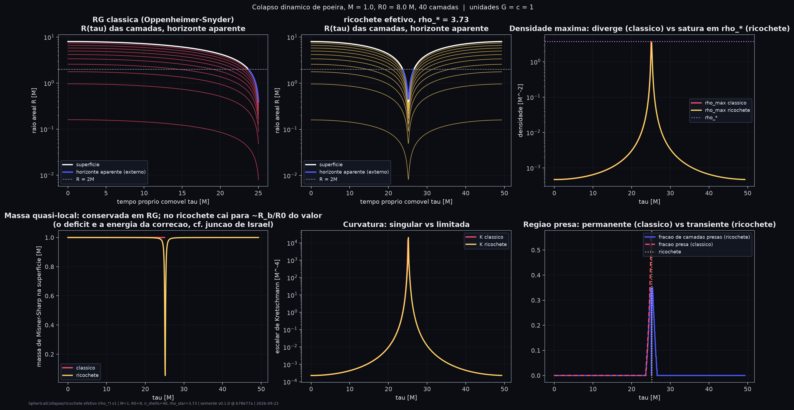

<div align="center">

# SEMENTE · blackhole-genesis

**Laboratório computacional de gravitação e cosmologia.**<br>
Pergunta-guia: *sob que condições físicas um colapso gravitacional pode transitar para um ricochete cosmológico não singular, e que assinaturas observáveis distinguiriam esse cenário da formação clássica de um buraco negro?*

[](README.md)
[](README.en.md)

[](pyproject.toml)
[](requirements.txt)
[](requirements.txt)
[](semente/stability/energy_conditions.py)
[](semente/ml/pinn.py)
[](semente/figures/)
[](web/index.html)
[](web/index.html)

[](tests/)
[](semente/validation.py)
[](LICENSE)
[](https://github.com/naderfilho/blackhole-genesis/commits/main)
[](https://github.com/naderfilho/blackhole-genesis/stargazers)


*Calculado, não desenhado: o parâmetro ℓ de Simpson–Visser vai de 0 (Schwarzschild) até 2.6M (buraco de minhoca). Entre os dois, dentro da "sombra" aparece o céu do outro universo (válido na geometria eterna).*

</div>

---

## Índice

- [Em 30 segundos](#em-30-segundos)
- [As cinco categorias de afirmação](#as-cinco-categorias-de-afirmação)
- [O que o laboratório faz (por estudo)](#o-que-o-laboratório-faz-por-estudo)
- [Resultados principais e resultados negativos](#resultados-principais-e-resultados-negativos)
- [O modelo contra os dados](#o-modelo-contra-os-dados)
- [Comece aqui](#comece-aqui)
- [Reprodutibilidade e validação](#reprodutibilidade-e-validação)
- [Estrutura](#estrutura)
- [Documentação](#documentação)
- [Referências](#referências)

---

## Em 30 segundos

| | |
|---|---|
| **O que é** | Uma plataforma modular (Python + WebGL) para investigar colapso gravitacional, buracos negros, geometrias regulares, black-bounces, transições para buraco branco, Einstein–Cartan, LQC efetiva, ricochetes cosmológicos, universos-filhos, perturbações, ondas gravitacionais, estabilidade, termodinâmica, informação e PINNs — com métricas, unidades, solvers, resultados, validações e figuras compartilhados. |
| **O que ela concluiu até agora** | A contração de poeira dentro de um buraco negro produz um espectro quase invariante de escala **sem inflação**, mas a versão mínima prevê $r = 24$ (excluído), **não** gera inflação emergente ($N<1$), **não** é robusta a anisotropias e **não** deixa assinatura de ringdown detectável. A garganta do black-bounce compatível com a junção é $\ell = R_b$. Para poeira, Einstein–Cartan e LQC efetiva são a mesma dinâmica. |
| **O que não é** | Uma prova de nada. Cada afirmação carrega uma das cinco categorias abaixo; resultados negativos são preservados. |
| **Experimente** | `python scripts/run_all.py` gera 38 figuras; `python -m semente.validation` roda 15 verificações; `web/index.html` é o ray-tracer em tempo real. |

---

## As cinco categorias de afirmação

| categoria | exemplo neste repositório |
|---|---|
| **resultado matemático/numérico** | Kruskal, Oppenheimer–Snyder, $\tau=\pi M$, Regge–Wheeler, QNMs de Leaver |
| **modelo teórico da literatura** | Einstein–Cartan (Popławski), LQC efetiva (Ashtekar–Pawlowski–Singh), Simpson–Visser, black-bounce carregado e rotativo |
| **hipótese especulativa** | limite holográfico no filho, seleção cosmológica, curva de Page do universo-filho |
| **resultado produzido por este código** | $\ell = R_b$ pela junção de Israel; EC ≡ LQC para poeira; $n_s = 1.00$ pelo ricochete; ausência de inflação emergente; falha da primeira lei em SV com $S=A/4$ |
| **conexão observacional possível** | $n_s$, $r$, $\alpha_s$, $\Omega_k$, GW150914, massas de pulsares |

Linguagem obrigatória: "o modelo prevê", "sob estas hipóteses", "a simulação é consistente com", "permanece especulativo". Nunca "isto prova que buracos negros criam universos". Ver [docs/01_foundations.md](docs/01_foundations.md).

---

## O que o laboratório faz (por estudo)

| # | estudo | módulo | doc | figuras |
|---|---|---|---|---|
| 1 | Colapso gravitacional dinâmico (LTB; densidade, massa, horizontes aparente e de eventos, curvatura, shell crossing), interior clássico **ou** regularizado | `collapse/dynamic.py` | [03](docs/03_gravitational_collapse.md) | 22, 23 |
| 2 | Black-bounce dinâmico: colapso → horizonte → alta curvatura → ricochete → re-expansão; junção de Israel com o exterior | `collapse/dynamic.py`, `collapse/junction.py` | [04](docs/04_black_bounce.md) | 16, 22, 23 |
| 3 | Einstein–Cartan (torção/spin): densidade crítica, escala mínima, curvatura, GR vs EC | `quantum/einstein_cartan.py`, `quantum/comparison.py` | [05](docs/05_einstein_cartan.md) | 06, 27, 28 |
| 4 | LQC efetiva ($H^2 = \tfrac{8\pi}{3}\rho(1-\rho/\rho_c)$), progenitor → condições iniciais do filho | `quantum/lqc.py`, `cosmology/seed_universe.py` | [06](docs/06_loop_quantum_cosmology.md) | 27, 28 |
| 5 | Condições de energia NEC/WEC/SEC/DEC (tensor de Einstein simbólico) para qualquer solução | `stability/energy_conditions.py` | [07](docs/07_stability.md) | 24, 33 |
| 6 | Estabilidade dinâmica: potenciais mestres, critério de estado ligado, robustez do ricochete a cisalhamento | `stability/perturbations.py`, `stability/bounce.py` | [07](docs/07_stability.md) | 25, 26 |
| 7 | Perturbações cosmológicas: escalares/tensoriais, $n_s$, $r$, running, ponte com Planck/BICEP | `cosmology/modes.py`, `cosmology/perturbations.py` | [08](docs/08_cosmological_perturbations.md) | 20, 29 |
| 8 | Expansão emergente: $H$, $\epsilon$, e-folds, entrada/saída — o código decide se há inflação | `cosmology/expansion.py` | [08](docs/08_cosmological_perturbations.md) | 30 |
| 9 | Geometrias rotativas: Kerr (horizontes, ergosfera, arrasto, ISCO) e black-bounce rotativo | `geometry/kerr.py` | [02](docs/02_geometry.md) | 34 |
| 10 | Geometrias carregadas: Reissner–Nordström e black-bounce carregado (fases em $(Q,\ell)$) | `geometry/charged.py`, `geometry/static.py` | [02](docs/02_geometry.md) | 33 |
| 11 | Ondas gravitacionais: QNMs (WKB), ringdown no domínio do tempo, ecos, espectrogramas, GW150914 | `gravitational_waves/` | [09](docs/09_gravitational_waves.md) | 31, 32 |
| 12 | Termodinâmica: $S=A/4$, $T$, primeira lei (Schwarzschild, RN, Kerr, SV), horizonte aparente vs de eventos no colapso | `thermodynamics/horizon.py` | [10](docs/10_thermodynamics.md) | 35 |
| 13 | Informação (exploratório): evaporação, curvas de Page, cenário universo-filho, escalas de tempo | `information/page_curve.py` | [11](docs/11_information.md) | 36 |
| 14 | PINNs: analítico vs solver vs rede; erro, conservação, vínculo, estabilidade entre sementes, modo híbrido | `ml/pinn.py`, `ml/benchmarks.py` | [12](docs/12_pinn.md) | 11, 38 |
| 15 | Espaço de parâmetros: varreduras 1D/2D, Monte Carlo com semente, refinamento adaptativo, classificação | `parameter_space/explorer.py` | [13](docs/13_parameter_space.md) | 37 |
| 16 | Ponte observacional: MODEL / PREDICTION / CONSTRAINT / RESIDUAL / UNCERTAINTY / SOURCE | `observations/` | [14](docs/14_observational_constraints.md) | tabelas |
| 17 | Validação automatizada: dimensional, limites, conservação, convergência, estabilidade, benchmarks | `semente/validation.py` | [01](docs/01_foundations.md) | relatório JSON |
| 18 | Reprodutibilidade: configs, sementes, proveniência (commit, versões, solver, timestamp) em cada figura e JSON | `core/provenance.py`, `core/config.py`, `configs/` | [01](docs/01_foundations.md) | rodapés |

Os estudos originais (Kruskal, interior de Schwarzschild, Oppenheimer–Snyder, modelo SEMENTE, seleção cosmológica, ray-tracing) continuam em [docs/01_matematica.md](docs/01_matematica.md), [docs/02_fronteira.md](docs/02_fronteira.md) e [docs/03_nascimento.md](docs/03_nascimento.md).

<details>
<summary><b>Ver o colapso dinâmico: clássico vs ricochete</b></summary>
<br>



</details>

---

## Resultados principais e resultados negativos

| resultado | categoria | onde |
|---|---|---|
| Interior de uma estrela em colapso = universo de Friedmann em contração; o buraco branco de Kruskal é apagado pelo colapso | resultado matemático | 01, fig. 01, 05 |
| Só $\ell = R_b$ (garganta = raio do ricochete) admite a junção de Israel; a parede pesa $R_b c^2/G$ | resultado deste código | 02_fronteira, fig. 16 |
| Para poeira, Einstein–Cartan e LQC efetiva são idênticas ($\rho_c \leftrightarrow \rho_b$); diferem para radiação | resultado deste código | 05, 06, fig. 27 |
| Colapso regularizado: região presa **transiente** (τ ∈ [23.7, 26.6] M), massa quasi-local cai a 5% no ricochete, sem horizonte de eventos decidido | resultado deste código | 03, 04, fig. 22 |
| Espectro do campo de teste através do ricochete: $n_s = 1.00$, sem inflação (mecanismo de Wands) | resultado deste código | 08, fig. 29 |
| **Negativo:** $r = 24$ vs $r < 0.036$: cenário mínimo excluído | resultado deste código + observação | 08, 14 |
| **Negativo:** nenhuma inflação emergente ($N<1$ e-fold, independente de $\rho_*$) | resultado deste código | 08, fig. 30 |
| **Negativo:** ricochete isotrópico não robusto a cisalhamento para razões de contração estelares | resultado deste código | 07, fig. 26 |
| **Negativo:** com $\ell = R_b$ o desvio de QNM é $<10^{-6}$; ecos só em $\ell > 2M$ | resultado deste código | 09, fig. 31, 32 |
| SV: $S = A/4$ independe de $\ell$ e a primeira lei falha por $1-\sqrt{1-\ell^2/4M^2}$ | resultado deste código | 10, fig. 35 |
| Campos de teste em black-bounces são linearmente estáveis (sem estado ligado) | resultado numérico | 07, fig. 25 |
| Sob o limite holográfico, a árvore de universos tem < 5 gerações e a seleção cosmológica vira deriva | hipótese especulativa → consequência calculada | 02_fronteira, fig. 17, 18 |

---

## O modelo contra os dados

| modelo | previsão | observado | residual | status |
|---|---|---|---|---|
| poeira + torção | $n_s = 1.01 \pm 0.02$ | 0.9665 ± 0.0038 | +2.4σ | tension |
| poeira + torção | $r = 24$ | < 0.036 | ×670 | **excluded** |
| radiação + LQC | $n_s = 2.9$ | 0.9665 | +20σ | **excluded** |
| interior fechado | $\Omega_k < 0$ | 0.0007 ± 0.0019 / −0.011 ± 0.0065 | ≤ 1.7σ | consistent, falsificável |
| Schwarzschild sem rotação | $f_{\rm ringdown}$ = 179 Hz | 251 ± 8 Hz (GW150914) | −5σ | excluded (rotação) |
| Kerr χ = 0.67 (literatura) | 250 Hz, 4.0 ms | 251 ± 8 Hz, 4.0 ± 0.3 ms | 0.1σ | literature:consistent |
| Smolin (1992) | $M_{\max,NS}$ ≈ 1.6 M☉ | 2.08 ± 0.07 M☉ | > 4σ | **excluded** |

"consistent" significa apenas "não excluído". Tabela completa em [docs/14](docs/14_observational_constraints.md).

---

## Comece aqui

```bash
git clone https://github.com/naderfilho/blackhole-genesis.git
cd blackhole-genesis
pip install -r requirements.txt
python -m pytest -q tests                # 89 testes (limites, conservacao, convergencia, benchmarks)
python -m semente.validation             # registro de 15 verificacoes -> output/validation_report.json
python scripts/run_all.py                # 38 figuras + JSONs com proveniencia em ./output
python scripts/reproduce.py "configs/*.json"   # reexecuta os estudos a partir de configuracoes
```

Visualizador em tempo real: [`web/index.html`](web/index.html) (WebGL2).

<details>
<summary><b>Usar como biblioteca</b></summary>
<br>

```python
from semente.collapse.dynamic import compare_classical_vs_bounce
from semente.cosmology.friedmann import einstein_cartan_dust
from semente.cosmology.modes import ModeSolver, bounce_background
from semente.stability import static_metric_report, analyze, simpson_visser_metric
from semente.gravitational_waves import wkb3, evolve
from semente.parameter_space import monte_carlo, classify_bounce
import numpy as np

classico, ricochete = compare_classical_vs_bounce(M=1.0, R0=8.0, Rb_over_R0=0.05)
print(ricochete.summary()["tau_last_trapped"])          # regiao presa transiente

sol = bounce_background(einstein_cartan_dust(1.0, 0.05**3))
print(ModeSolver(sol).spectrum(np.logspace(-0.7, 0, 6)).n_s)   # ~1.00

print(static_metric_report("simpson_visser", np.linspace(-6, 6, 300), M=1, l=0.5).summary()["NEC"])
print(analyze(simpson_visser_metric(1, 0.5), spin=0).classification)   # stable
print(wkb3(simpson_visser_metric(1, 0.5), spin=0, ell=2).omega)
print(monte_carlo(classify_bounce, dict(rho_star=(2, 1e3), sigma0_sq=(1e-6, 10)), n=20, seed=1, log_scale=("rho_star", "sigma0_sq")).labels)
```

</details>

---

## Reprodutibilidade e validação

- Cada figura tem um rodapé com modelo, parâmetros, versão do pacote, commit e data; cada JSON de resultado tem um `.meta.json` (`RunRecord`: parâmetros, solver, semente, versões de numpy/scipy/sympy/torch, plataforma, timestamp).
- `configs/*.json` descrevem estudos; `scripts/reproduce.py` os reexecuta.
- `semente/validation.py` é o registro auditável: unidades, limites ($\ell\to0$, $\sigma\to0$, $\rho_c\to\infty$, $\rho_*\to\infty$), conservação (vínculo de Friedmann, massa de Misner–Sharp), convergência (camadas, grade), estabilidade, benchmarks analíticos (solução exata, Oppenheimer–Snyder, Leaver).
- Um único integrador (`core/solvers.py`) com tolerâncias registradas.

---

## Estrutura

```
semente/
  core/            unidades, proveniencia, solver unico, configuracoes de estudo
  geometry/        familia estatica generica, Schwarzschild/Kruskal/Penrose, SV, RN, carregado, Kerr, geodesicas, interior
  collapse/        Oppenheimer-Snyder, colapso dinamico (LTB + ricochete), juncao de Israel
  quantum/         Einstein-Cartan, LQC efetiva, comparacao
  cosmology/       Friedmann unificado, modos, expansao, curvatura, universo-filho, selecao
  stability/       condicoes de energia, potenciais mestres, robustez do ricochete
  gravitational_waves/  QNM (WKB), ringdown no tempo, ecos
  thermodynamics/  horizontes, genealogia
  information/     curvas de Page (EXPLORATORIO)
  ml/              PINNs, benchmarks
  raytracing/      imagens (CPU)         web/index.html: GPU em tempo real
  observations/    restricoes com fonte, ponte observacional, pulsares
  parameter_space/ varreduras, Monte Carlo, adaptativo, classificacao
  figures/         toda a visualizacao
  validation.py    registro de verificacoes
configs/           estudos reprodutiveis       scripts/   run_all, reproduce
tests/             89 testes                   docs/      00-15 + os tres documentos originais
```

Os módulos antigos (`semente.geometry`, `semente.bounce`, `semente.fronteira`, `semente.nascimento`, ...) continuam importáveis como fachadas.

---

## Documentação

[00 auditoria](docs/00_audit.md) · [01 fundamentos](docs/01_foundations.md) · [02 geometrias](docs/02_geometry.md) · [03 colapso](docs/03_gravitational_collapse.md) · [04 black-bounce](docs/04_black_bounce.md) · [05 Einstein–Cartan](docs/05_einstein_cartan.md) · [06 LQC](docs/06_loop_quantum_cosmology.md) · [07 estabilidade](docs/07_stability.md) · [08 perturbações](docs/08_cosmological_perturbations.md) · [09 ondas gravitacionais](docs/09_gravitational_waves.md) · [10 termodinâmica](docs/10_thermodynamics.md) · [11 informação](docs/11_information.md) · [12 PINN](docs/12_pinn.md) · [13 espaço de parâmetros](docs/13_parameter_space.md) · [14 restrições observacionais](docs/14_observational_constraints.md) · [15 limitações](docs/15_limitations.md)

Cada documento tem: objetivo, formulação matemática, hipóteses, método numérico, parâmetros, validação, resultados, limitações, referências.

---

## Referências

<details>
<summary><b>Ver as referências</b></summary>
<br>

- Oppenheimer & Snyder (1939) Phys. Rev. 56, 455. Kruskal (1960) Phys. Rev. 119, 1743. Misner & Sharp (1964) Phys. Rev. 136, B571.
- Regge & Wheeler (1957) PR 108, 1063. Bardeen, Press & Teukolsky (1972) ApJ 178, 347. Bardeen, Carter & Hawking (1973) CMP 31, 161.
- Page & Thorne (1974) ApJ 191, 499. Hawking (1975) CMP 43, 199. Page (1993) PRL 71, 3743. Leaver (1985) Proc. R. Soc. A 402, 285. Iyer & Will (1987) PRD 35, 3621.
- Frolov, Markov & Mukhanov (1990) PRD 41, 383. Smolin (1992) CQG 9, 173. Hayward (1994) PRD 49, 6467. Wands (1999) PRD 60, 023507.
- Ashtekar, Pawlowski & Singh (2006) PRL 96, 141301. Berti, Cardoso & Will (2006) PRD 73, 064030. Bojowald, Harada & Tibrewala (2008) PRD 78, 064057.
- Popławski (2010) PLB 694, 181; (2012) PRD 85, 107502. Cai, Xue, Brandenberger & Zhang (2009) JCAP 05, 011. Bronnikov, Konoplya & Zhidenko (2012) PRD 86, 024028.
- Haggard & Rovelli (2015) PRD 92, 104020. Cardoso, Franzin & Pani (2016) PRL 116, 171101. Brandenberger & Peter (2017) Found. Phys. 47, 797.
- Ashtekar, Olmedo & Singh (2018) PRL 121, 241301. Simpson & Visser (2019) JCAP 02, 042. Raissi, Perdikaris & Karniadakis (2019) J. Comput. Phys. 378, 686.
- Kelly, Santacruz & Wilson-Ewing (2020) PRD 102, 106024. Churilova & Stuchlík (2020) CQG 37, 075014. Planck 2018 VI, IX, X (2020) A&A 641.
- Franzin, Liberati, Mazza, Simpson & Visser (2021) JCAP 07, 036. Mazza, Franzin & Liberati (2021) JCAP 04, 082. BICEP/Keck (2021) PRL 127, 151301. Almheiri et al. (2021) RMP 93, 035002.
- LIGO/Virgo (2016) PRL 116, 061102; 221101. Fonseca et al. (2021) ApJL 915, L12. Egan & Lineweaver (2010) ApJ 710, 1825.

</details>

<div align="center">

Licença MIT · Autor: **Nader Filho**

</div>
