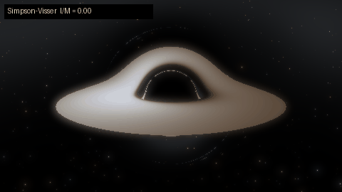
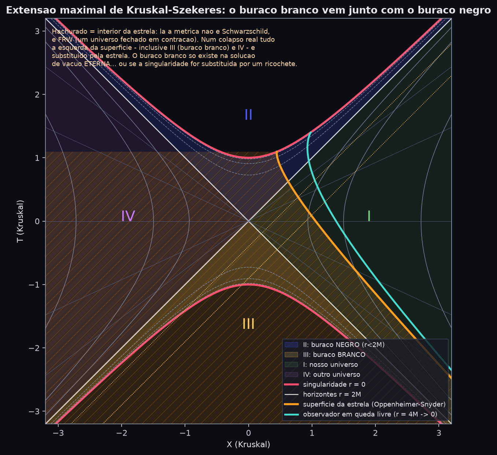
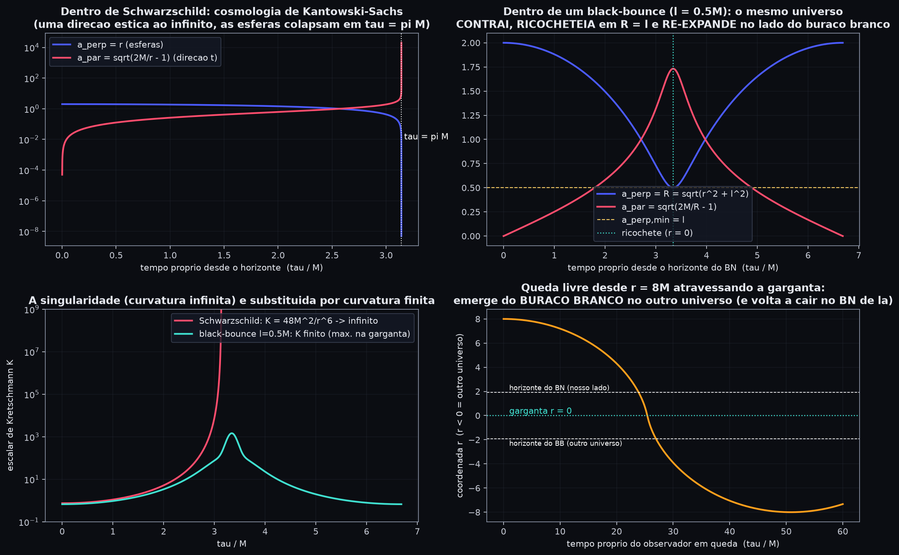
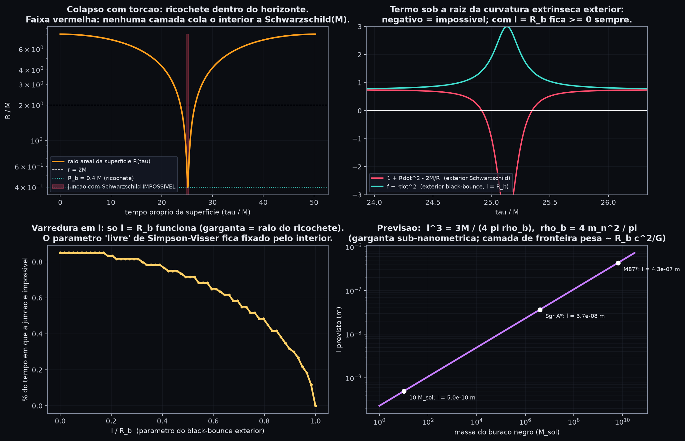
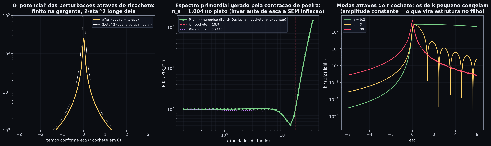
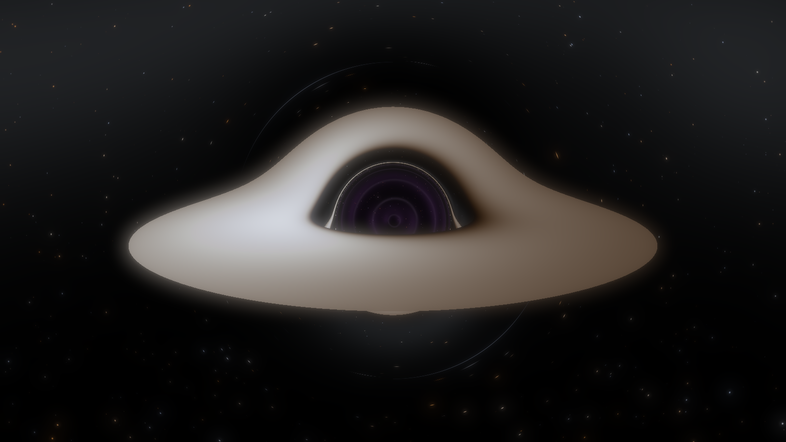

<div align="center">

# 🌌 SEMENTE · blackhole-genesis

**Todo buraco negro guarda a semente de um buraco branco. Todo buraco branco é um Big Bang.**<br>
Este repositório transforma essa frase em equações resolvidas, redes neurais treinadas e imagens calculadas, sem esconder onde a física termina e a especulação começa.

[](README.md)
[](README.en.md)

[](pyproject.toml)
[](requirements.txt)
[](requirements.txt)
[](semente/geodesics.py)
[](semente/pinn.py)
[](semente/figures.py)
[](web/index.html)
[](web/index.html)

[](tests/)
[](LICENSE)
[](https://github.com/naderfilho/blackhole-genesis)
[](https://github.com/naderfilho/blackhole-genesis/commits/main)
[](https://github.com/naderfilho/blackhole-genesis/stargazers)



*Animação calculada, não desenhada: o parâmetro ℓ de Simpson–Visser vai de 0 (Schwarzschild, sombra preta) até 2.6M (buraco de minhoca). Entre os dois, dentro da "sombra" aparece o céu do outro universo, visto através do buraco branco.*

</div>

---

## 📑 Índice

- [Em 30 segundos](#-em-30-segundos)
- [A ideia, em uma cadeia de fatos](#-a-ideia-em-uma-cadeia-de-fatos)
- [O diferencial: perguntas em aberto](#-o-diferencial-experimentos-sobre-perguntas-em-aberto)
- [O modelo contra o nosso universo](#-o-modelo-contra-o-nosso-universo)
- [Comece aqui](#-comece-aqui)
- [Galeria](#%EF%B8%8F-galeria)
- [Estrutura](#%EF%B8%8F-estrutura)
- [Honestidade científica](#%EF%B8%8F-honestidade-científica-leia-antes-de-citar)
- [Referências](#-referências)

---

## ⚡ Em 30 segundos

| | |
|---|---|
| **O que é** | Um pacote Python + um visualizador WebGL que resolvem, numericamente e com redes neurais, a cadeia *colapso → buraco negro → ricochete → buraco branco → Big Bang de outro universo*. |
| **O que tem de novo** | Três resultados calculados aqui: a garganta do buraco negro regular fica **fixada** pelo interior (ℓ = R_b); sob o limite holográfico a árvore de universos tem **< 5 gerações**; o espectro primordial gerado pelo ricochete sai com **n_s ≈ 1 sem inflação**. |
| **O que não é** | Uma prova. Nada aqui foi observado. Cada afirmação está rotulada como *teorema*, *modelo* ou *hipótese*. |
| **Experimente** | `python scripts/run_all.py` gera 21 figuras. Abra `web/index.html` e arraste ℓ. |

---

## 🧭 A ideia, em uma cadeia de fatos

| # | afirmação | status | onde no código |
|---|---|---|---|
| 1 | A extensão maximal de Schwarzschild contém, obrigatoriamente, um buraco **branco** e um segundo universo. | **teorema** (Kruskal 1960) | `geometry.py`, fig. 01, 02 |
| 2 | Dentro do horizonte, $r$ é tempo: o interior de um buraco negro **é** uma cosmologia (Kantowski–Sachs) que dura exatamente $\pi M$. | **teorema** | `interior.py`, fig. 04 |
| 3 | O interior de uma estrela em colapso **é** um universo de Friedmann fechado em contração (Oppenheimer–Snyder). | **teorema** (1939) | `collapse.py`, fig. 05 |
| 4 | Num colapso real, o buraco branco e o outro universo **não existem**: a estrela ocupa o lugar deles. | **teorema** | fig. 01 (região hachurada) |
| 5 | Se a singularidade for substituída por um ricochete, a contração do item 3 vira uma expansão: um Big Bang. Torção de Einstein–Cartan e cosmologia quântica de laço fazem isso. | **modelo publicado** (Popławski 2010; Ashtekar et al. 2006) | `bounce.py`, fig. 06 |
| 6 | Existe uma métrica exata (Simpson–Visser 2019) em que o buraco negro atravessa uma garganta regular e sai como buraco branco em **outro universo**; o interior contrai até $R=\ell$ e re-expande. | **solução exata** com matéria efetiva exótica | `geometry.py`, `raytracer.py`, `web/`, fig. 03, 04, 10, 12–15 |
| 7 | Para um buraco negro pai de massa $M$, dá para calcular densidade, tamanho e tempo do "Big Bang" do filho. | **modelo SEMENTE** (síntese deste projeto) | `bounce.SeedUniverse`, fig. 07 |
| 8 | Se cada filho herda as constantes do pai com mutações, a população de universos evolui para maximizar a produção de buracos negros (Smolin). | **hipótese falsificável** | `selection.py`, fig. 08 |
| 9 | Uma rede neural que só vê as equações (PINN) reconstrói o ricochete com erro $10^{-5}$. | **resultado deste projeto** | `pinn.py`, fig. 11 |

<details>
<summary><b>📐 Ver o diagrama de Kruskal com a estrela apagando o buraco branco</b></summary>
<br>



A região hachurada é o interior da estrela: lá a métrica é Friedmann, não Schwarzschild. Num colapso real, tudo à esquerda da superfície (inclusive as regiões III e IV) é substituído pela estrela. O buraco branco só existe na solução de vácuo eterna, ou se a singularidade for substituída por um ricochete.

</details>

<details>
<summary><b>🕳️ Ver o universo dentro do buraco negro ricocheteando</b></summary>
<br>



</details>

Derivações completas em [`docs/01_matematica.md`](docs/01_matematica.md).

---

## 🔬 O diferencial: experimentos sobre perguntas em aberto

Quatro testes numéricos feitos dentro dos modelos acima, com resultados que, até onde sabemos, não estavam calculados nesta forma (`semente/fronteira.py`, figuras 16–19, [`docs/02_fronteira.md`](docs/02_fronteira.md)).

| # | pergunta aberta | o que o teste encontrou |
|---|---|---|
| A | O que acontece **fora** da estrela quando o interior ricocheteia? | A junção de Israel com Schwarzschild é impossível num intervalo finito em torno do ricochete. Na família black-bounce, **só ℓ = R_b** funciona: $\ell^3 = 3M/4\pi\rho_b$. Para 10 M☉, ℓ ≈ 5×10⁻¹⁰ m; a parede entre os universos pesa $R_b c^2/G \approx 7\times10^{17}$ kg. |
| B | O horizonte do pai limita a entropia do filho? | Se sim, o pai do nosso universo tinha ≥ 5×10¹³ M☉ e uma árvore de universos com a nossa fecundidade tem **menos de 5 gerações**. |
| C | A seleção natural cosmológica funciona com esse limite? | Não: a fecundidade efetiva cai para ~1 filho por universo e a dinâmica vira deriva neutra. **CNS e holografia são quase incompatíveis.** |
| D | A previsão de Smolin (M_max de estrelas de nêutrons ≈ 1.6 M☉) sobrevive aos dados? | Excluída por > 4σ em quatro pulsares; a versão revisada (2 M☉) está no limite. |

<details>
<summary><b>📊 Ver a figura da junção (por que só ℓ = R_b funciona)</b></summary>
<br>



</details>

Cada resultado depende de uma hipótese explícita (tratamento efetivo da torção; limite holográfico). É onde a física está indecisa, e por isso são testes, não teoremas.

---

## 🌍 O modelo contra o nosso universo

Nada confirma que nascemos de um buraco negro. O que dá para fazer é o teste de consistência: o modelo prevê propriedades do universo-filho; medimos o nosso (Planck 2018, BICEP/Keck 2021); comparamos (`semente/nascimento.py`, figuras 20–21, [`docs/03_nascimento.md`](docs/03_nascimento.md)).

| previsão do modelo | previsto | observado | veredito |
|---|---|---|---|
| Espectro primordial (Mukhanov–Sasaki através do ricochete, vácuo de Bunch–Davies na contração de poeira) | $n_s = 1.004$, < 1% de variação em 1.2 décadas | $n_s = 0.9665 \pm 0.0038$ | 🟢 **compatível**: quase-invariância de escala **sem inflação** |
| Curvatura: o filho é fechado | $\Omega_k < 0$ | Planck+BAO $0.0007\pm0.0019$; Planck só $-0.011\pm0.0065$ | 🟢 **compatível**, falsificável |
| Massa do pai (curvatura + conservação) | $\ge 4.7\times10^{23}\,M_\odot$ | massa do universo observável ~ $10^{23}\,M_\odot$ | 🟡 consistente (não é evidência) |
| Razão tensor/escalar do ricochete de matéria mínimo | $r = 24$ | $r < 0.036$ | 🔴 **falsificado** na versão mínima |
| Expansão acelerada | não prevista | $\Lambda$ domina | ⚪ não previsto |

<details>
<summary><b>📈 Ver o espectro primordial saindo do ricochete</b></summary>
<br>



</details>

**Placar:** quatro compatíveis, um falsificado, um não previsto. O modelo está **vivo e restrito**. O próximo teste natural (aberto neste repositório) é refazer o espectro com $k=+1$ e com os tensores, para ver se $r$ cai.

---

## 🚀 Comece aqui

```bash
git clone https://github.com/naderfilho/blackhole-genesis.git
cd blackhole-genesis
pip install -r requirements.txt
python -m pytest -q tests          # 27 testes de consistência física
python scripts/run_all.py          # gera 21 figuras + renders em ./output (~4 min em CPU)
```

**Visualizador em tempo real:** abra [`web/index.html`](web/index.html) num navegador com WebGL2 e arraste **ℓ** de 0 até 3. Cada pixel integra a geodésica exata na GPU.

<details>
<summary><b>🐍 Usar como biblioteca</b></summary>
<br>

```python
from semente.geometry import BlackBounce
from semente.interior import radial_infall_black_bounce
from semente.bounce import SeedUniverse, M_SUN
from semente.raytracer import render, Scene, Camera, save_png
from semente.nascimento import BounceSpectrum
import numpy as np

bb = BlackBounce(M=1.0, l=0.8)
print(bb.kind, bb.horizons)                      # horizontes em ±sqrt(4M² − ℓ²)
q = radial_infall_black_bounce(l=0.8, r0=8.0)    # r(τ) atravessa r = 0 e emerge no outro lado
print(SeedUniverse(10 * M_SUN).table())          # o universo-filho de um BN de 10 massas solares
save_png(render(Scene(l=0.8), Camera(width=960, height=540)), "meu_buraco.png")

bs = BounceSpectrum(a_b=0.05)                    # espectro primordial através do ricochete
ks = np.logspace(-0.7, 0.3, 8)
print(bs.spectral_index(ks, bs.spectrum(ks)))    # ≈ 1.00
```

</details>

<details>
<summary><b>🧪 Rodar só uma parte</b></summary>
<br>

```bash
python scripts/run_all.py --sem-render      # só as figuras científicas (~1 min)
python scripts/run_all.py --rapido          # renders em 640x360
python -m semente.figures_fronteira         # só os experimentos de fronteira
python -m semente.figures_nascimento        # só o veredito vs Planck/BICEP
```

</details>

---

## 🖼️ Galeria

<details>
<summary><b>Ver a lista completa das 21 figuras</b></summary>
<br>

| arquivo | conteúdo |
|---|---|
| `01_kruskal.png` | As quatro regiões de Kruskal, a estrela de Oppenheimer–Snyder (que apaga o buraco branco) e um observador em queda. |
| `02_penrose.png` | Penrose de Schwarzschild eterno e a "escada" de universos do black-bounce. |
| `03_flamm_wormhole.png` | Paraboloide de Flamm (ponte de Einstein–Rosen) e a garganta lisa de um buraco de minhoca. |
| `04_interior_universo.png` | Os fatores de escala do universo dentro do buraco negro; com ricochete; Kretschmann finito; queda através da garganta. |
| `05_colapso_oppenheimer_snyder.png` | Colapso: superfície, horizonte de eventos nascendo no centro, $a(\tau)$ FRW e sua versão com tempo invertido. |
| `06_ricochete.png` | GR pura vs torção vs LQC: $a(t)$, $H(t)$, densidade efetiva. Solução exata sobreposta. |
| `07_tabela_universo_filho.png/.json` | Propriedades do universo-filho para pais de 3 a 6.5×10⁹ massas solares. |
| `08_selecao_cosmologica.png` | Seleção natural cosmológica: fecundidade média e migração da população na paisagem. |
| `09_deflexao.png` | Ângulo de deflexão da luz vs parâmetro de impacto; divergência na esfera de fótons. |
| `10_geodesicas.png` | Órbitas de fótons e partículas (integrador geral com Christoffel simbólico). |
| `11_pinn.png` | PINN vs integrador: ricochete e órbita de fóton. |
| `12–15_render_*.png` | Ray-tracer: Schwarzschild, black-bounce, buraco de minhoca, lente vista de cima. |
| `16_fronteira_juncao.png` | Junção de Israel do ricochete: onde Schwarzschild falha, por que só ℓ = R_b funciona, ℓ previsto vs massa. |
| `17_fronteira_entropia.png` | Piso de massa do pai pelo limite entrópico; profundidade máxima da árvore de universos. |
| `18_fronteira_selecao_orcamento.png` | Seleção de Smolin com orçamento holográfico: a fecundidade efetiva colapsa para ~1. |
| `19_fronteira_estrelas_neutrons.png` | Massas de pulsares vs previsão de Smolin. |
| `20_nascimento_espectro.png` | Mukhanov–Sasaki através do ricochete: potencial, espectro com n_s ≈ 1, modos congelando. |
| `21_nascimento_veredito.png` | Massa do pai vs curvatura observada e a tabela de vereditos. |

</details>

<div align="center">


*Buraco negro regular (ℓ = 1M) com disco de acreção de Page–Thorne. Geodésicas exatas, redshift gravitacional + Doppler, cor de corpo negro. A única liberdade estética é a temperatura do disco.*
</div>

---

## 🗂️ Estrutura

```
semente/
  geometry.py          Schwarzschild, Kruskal (Lambert W), Penrose, Flamm, black-bounce, Kretschmann
  geodesics.py         Christoffel via sympy -> integrador DOP853; forma orbital u(phi); deflexão
  interior.py          Kantowski-Sachs dentro do BN; ricochete do interior; queda pela garganta
  collapse.py          Oppenheimer-Snyder: junção FRW/Schwarzschild, horizonte de eventos, Kruskal da superfície
  bounce.py            Friedmann com torção (+ solução exata), LQC, modelo SEMENTE, Pathria
  selection.py         dinâmica populacional de Smolin
  pinn.py              PINNs (torch): ricochete na variável de volume; órbita de fóton
  raytracer.py         ray-tracer numpy: Page-Thorne (forma fechada), redshift, lente, dois céus
  fronteira.py         experimentos sobre perguntas em aberto  (+ figures_fronteira.py)
  nascimento.py        previsões para o universo-filho vs Planck/BICEP  (+ figures_nascimento.py)
  figures.py           todas as figuras
web/index.html         ray-tracer WebGL2 em tempo real (GLSL)
tests/                 27 testes
docs/                  derivações (01), fronteira (02), nascimento (03)
```

---

## ⚖️ Honestidade científica (leia antes de citar)

- Itens 1–4 da cadeia são **teoremas** da relatividade geral. O item 4 é o que a maioria das divulgações omite: o buraco branco de Kruskal é apagado pelo colapso.
- Itens 5–6 são **modelos**: dependem de física além da relatividade clássica. São soluções exatas *das equações desses modelos*, não observações.
- O argumento "o raio de Schwarzschild do universo observável é igual ao seu tamanho" é uma **identidade** da equação de Friedmann para universo plano ($r_s = c/H_0$ exatamente), não uma evidência.
- O modelo SEMENTE mínimo gera um universo-filho **pequeno e efêmero** e prevê $r = 24$, excluído pelos dados. Para virar um universo como o nosso precisa de física extra. A tabela do veredito diz isso com números.
- Nada aqui foi observado. Buracos brancos nunca foram detectados.

---

## 📚 Referências

<details>
<summary><b>Ver as referências</b></summary>
<br>

- Oppenheimer, J. R. & Snyder, H. (1939). *On Continued Gravitational Contraction.* Phys. Rev. 56, 455.
- Kruskal, M. (1960). Phys. Rev. 119, 1743. Szekeres, G. (1960). Publ. Math. Debrecen 7, 285.
- Novikov, I. (1964). *Delayed explosion of a part of the Fridman universe and quasars.* Astron. Zh. 41, 1075.
- Pathria, R. K. (1972). *The Universe as a Black Hole.* Nature 240, 298.
- Page, D. N. & Thorne, K. S. (1974). *Disk-Accretion onto a Black Hole.* ApJ 191, 499.
- Frolov, V., Markov, M. & Mukhanov, V. (1990). *Black holes as possible sources of closed and semiclosed worlds.* Phys. Rev. D 41, 383.
- Smolin, L. (1992). *Did the universe evolve?* Class. Quantum Grav. 9, 173.
- Wands, D. (1999). *Duality invariance of cosmological perturbation spectra.* Phys. Rev. D 60, 023507.
- Ashtekar, A., Pawlowski, T. & Singh, P. (2006). *Quantum nature of the Big Bang.* Phys. Rev. Lett. 96, 141301.
- Popławski, N. (2010). *Cosmology with torsion: An alternative to cosmic inflation.* Phys. Lett. B 694, 181.
- Popławski, N. (2012). *Nonsingular, big-bounce cosmology from spinor-torsion coupling.* Phys. Rev. D 85, 107502.
- Haggard, H. & Rovelli, C. (2015). *Black hole fireworks.* Phys. Rev. D 92, 104020.
- Ashtekar, A., Olmedo, J. & Singh, P. (2018). *Quantum Transfiguration of Kruskal Black Holes.* Phys. Rev. Lett. 121, 241301.
- Simpson, A. & Visser, M. (2019). *Black-bounce to traversable wormhole.* JCAP 02, 042.
- Raissi, M., Perdikaris, P. & Karniadakis, G. (2019). *Physics-informed neural networks.* J. Comput. Phys. 378, 686.
- Planck Collaboration (2020). *Planck 2018 results. VI.* A&A 641, A6. BICEP/Keck (2021). Phys. Rev. Lett. 127, 151301.

</details>

<div align="center">

Licença MIT · Autor: **Nader Filho**

</div>
